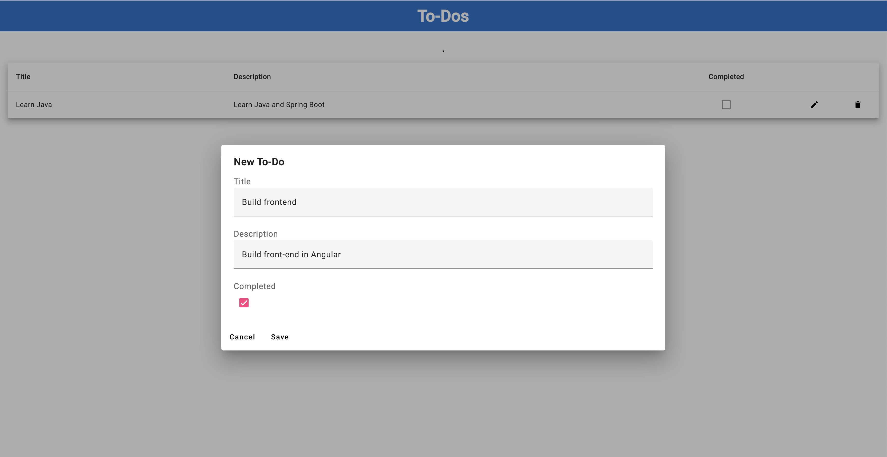
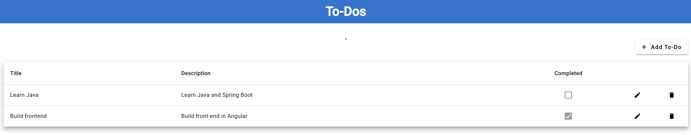

# Overview

This is an example of a [multi-repository Codespace](https://docs.github.com/en/codespaces/managing-your-codespaces/managing-repository-access-for-your-codespaces). The code for the frontend is in this repo. The backend is in a [separate repo](https://github.com/bxtp4p-demos/codespaces-spring-boot-mysql-template). 

The frontend is an Angular app and the backend is a Spring Boot app. The frontend is configured to proxy requests to the backend.

## Multirepository Codespace Setup

Access to the backend repo is configured in [devcontainer.json](.devcontainer/devcontainer.json#L22). 

The backend repo is cloned into the Codespace in the `devcontainer.json` [`updateContentCommand`](.devcontainer/devcontainer.json#L16) script.

There is also a [VS Code workspace file](todo-app.code-workspace#L2) to configure a workspace with both repos added to the workspace.

## Running the App

Due to a [known issue](https://github.com/orgs/community/discussions/15351#discussioncomment-4112535) with Codespaces port visibility and CORS, you will need to open this codespace in VS Code Desktop.

Once the codespace is opened, open the VS Code workspace and run the `Run Backend` task. This will start the Spring Boot backend.

Then run the `Run Frontend` task. This will start the Angular app and proxy requests to the backend.

Once the frontend is running, you can access the app at `https://localhost:4200`.

